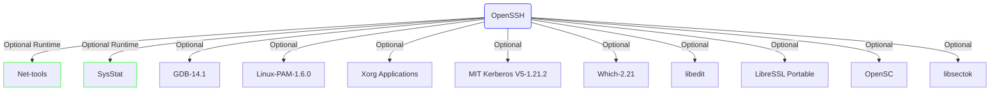

vi /etc/sysconfig/console
FONT="default8x16"


## Setup OpenSSH

This is the starting point after completing LFS first build and boot. As this is new system their are many softwares and configuration missing.
We don't even have `wget` to download new software packages.  
Thus the first action we have to take is to setup OpenSSH to ease out complete setup process. After SSH setup, We can use Putty (to remote login) or WinScp (to transfer files).

OpenSSH has two optional dependencies (Net-tools and SysStat). Though dependencies are optional, its good to install them first.




As we cannot download there packages on LFS system we have to download it separately and copy on LFS system.

I downloaded them on my local system and created ISO file and attached to LFS system as CD-Rom.


- https://www.linuxfromscratch.org/blfs/view/stable/postlfs/openssh.html  
OpenSSH-9.6p1

- https://www.linuxfromscratch.org/blfs/view/stable/basicnet/net-tools.html  
Net-tools-2.10

- https://www.linuxfromscratch.org/blfs/view/stable/general/sysstat.html  
Sysstat-12.7.5


```bash

mkdir blfs && cd blfs

# OpenSSH-9.6p1
wget https://ftp.openbsd.org/pub/OpenBSD/OpenSSH/portable/openssh-9.6p1.tar.gz

# Net-tools-2.10
wget https://downloads.sourceforge.net/project/net-tools/net-tools-2.10.tar.xz

# Sysstat-12.7.5
wget https://sysstat.github.io/sysstat-packages/sysstat-12.7.5.tar.xz

cd ..

mkisofs -JR -o blfs.iso blfs/
```

Attach the generated `blfs.iso` file to VBOX and run below command on LFS system to mount the ISO.

```bash
mkdir /mnt/cdrom
mount /dev/cdrom /mnt/cdrom
```

