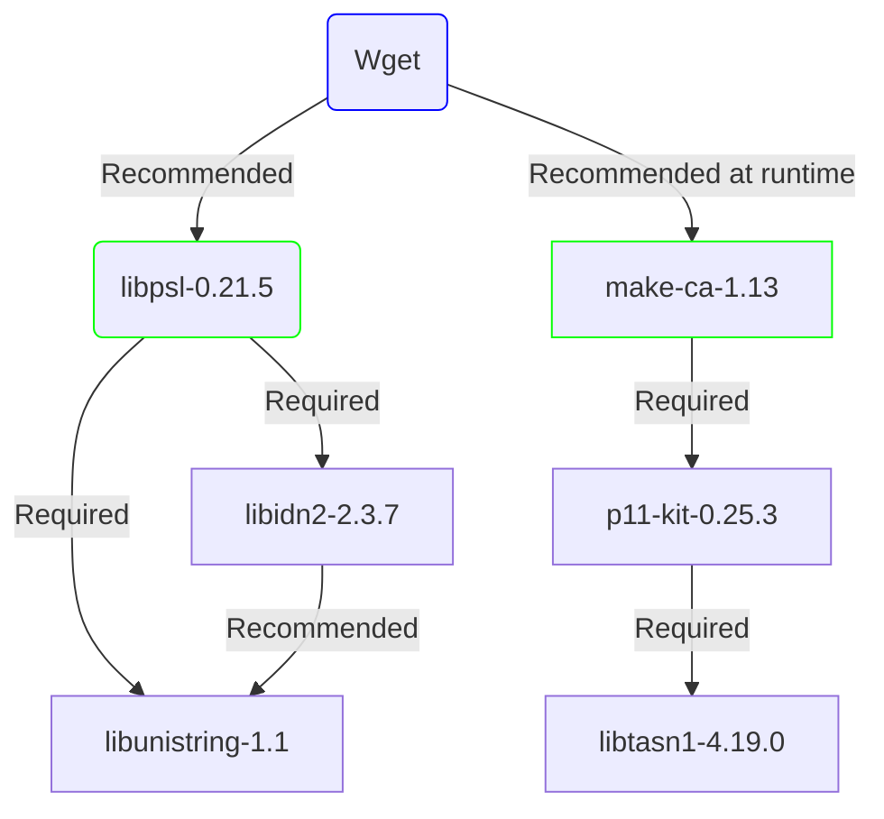

## Wget Install


### Dependency chart



### Download links ( Follow individual package link for installation )
```bash
### libtasn1-4.19.0  
### https://www.linuxfromscratch.org/blfs/view/stable/general/libtasn1.html  
wget https://ftp.gnu.org/gnu/libtasn1/libtasn1-4.19.0.tar.gz

### libunistring-1.1  
### https://www.linuxfromscratch.org/blfs/view/stable/general/libunistring.html  
wget https://ftp.gnu.org/gnu/libunistring/libunistring-1.1.tar.xz  

### p11-kit-0.25.3  
### https://www.linuxfromscratch.org/blfs/view/stable/postlfs/p11-kit.html  
wget https://github.com/p11-glue/p11-kit/releases/download/0.25.3/p11-kit-0.25.3.tar.xz  

### libidn2-2.3.7  
### https://www.linuxfromscratch.org/blfs/view/stable/general/libidn2.html  
wget https://ftp.gnu.org/gnu/libidn/libidn2-2.3.7.tar.gz  

### libpsl-0.21.5  
### https://www.linuxfromscratch.org/blfs/view/stable/basicnet/libpsl.html  
wget https://github.com/rockdaboot/libpsl/releases/download/0.21.5/libpsl-0.21.5.tar.gz  

### make-ca-1.13  
### https://www.linuxfromscratch.org/blfs/view/stable/postlfs/make-ca.html  
wget https://github.com/lfs-book/make-ca/releases/download/v1.13/make-ca-1.13.tar.xz  


### Wget-1.21.4
### https://www.linuxfromscratch.org/blfs/view/stable/basicnet/wget.html
wget https://ftp.gnu.org/gnu/wget/wget-1.21.4.tar.gz
```